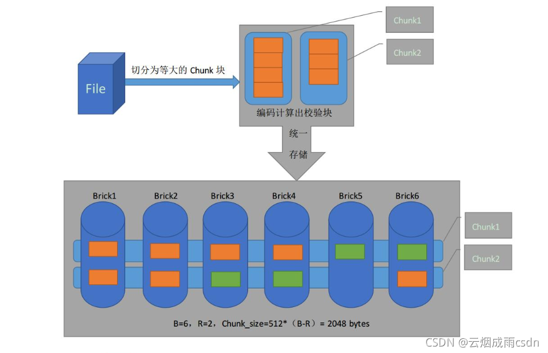

# MyMinIO
## MinIO应用场景
总结--》“用于非结构化数据的存储”

## 1.基本介绍
### 是什么
MinIO是基于Apache License V2.0开源协议的**对象存储服务**
### 特点
- 适合于存储大容量的非结构化数据，比如图片，视频、日志、备份数据、容器/虚拟机镜像等，单个对象支持5个TB
- MinIO是一个轻量级服务，可以很简单和其他应用来结合，比如NodeJS、Redis、MySQL
- 部署简单、跨平台 底层是go语言实现，天然支持跨平台
- 读写高性能,在标准硬件上，读/写速度上高达183 GB / 秒 和 171 GB / 秒
- 分布式支持
- 数据恢复、磁盘损坏高容忍
- 容器化支持 MinIO提供了与k8s、etcd、docker等容器化技术深度集成方案
- 与Amazon S3 兼容，Amazon的S3 API是对象存储领域的标准，就是说现在为了节约成本使用MinIO，等公司壮大了、有钱了。
不想自己运维基础设施了，就可以把对象存储放到云上，只要云厂商支持S3标准，应用程序是不需要重新开发的。

### 官网
英文 https://min.io/  
中文（更新不及时） http://www.minio.org.cn/

2.使用场景
- 存储大容量的非结构化数据，比如图片，视频、日志、备份数据、容器/虚拟机镜像等
- 需要与k8s、etcd、docker等容器化技术深度集成

3.实际使用

## 2.基本概念
### S3
Simple Storage Service，简单存储服务，这个概念是Amazon在2006年推出的，对象存储就是从那个时候诞生的。S3提供了一个简单Web服务接口，可用于随时在Web上的任何位置存储和检索任何数量的数据。
### Object
存储到 Minio 的基本对象，如文件、字节流，Anything...
### Bucket
用来存储 Object 的逻辑空间。每个 Bucket 之间的数据是相互隔离的。
### Drive
部署 Minio 时设置的磁盘，Minio 中所有的对象数据都会存储在 Drive 里。
### Set(目前没有特别清晰的说明)
一组 Drive 的集合
- 分布式部署根据集群规模自动划分一个或多个 Set，比如有64块磁盘情况下，8个磁盘分作是一个set；8块磁盘的情况下，就只分一个set
- 一个set对应的是一组（多个）Drive 磁盘
- 一个对象存储在一个 Set 上，但是因为一个set会有多个磁盘，所以一个对象可能会分很多part，分别存储在这8个磁盘中

## 3.纠删码
### 纠删码是什么
纠删码（erasure coding，EC）是一种用于重建 丢失、损坏数据的数学算法。 

### 使用纠删码的目的
Minio使用纠删码erasure code和校验和checksum来保护数据免受硬件故障和数据损坏。 即便丢失一半数量（N/2）的硬盘，仍然可以恢复数据

### 实现原理
将数据分割成片段，把冗余数据块扩展、编码，并将其存储在不同的位置，比如磁盘、存储节点或者其它地理位置。

Minio采用Reed-Solomon code将对象拆分成N/2数据和N/2 奇偶校验块。 这就意味着如果是12块盘，一个对象会被分成6个数据块、6个奇偶校验块，你可以丢失任意6块盘（不管其是存放的数据块还是奇偶校验块），你仍可以从剩下的盘中的数据进行恢复。

## 需验证项
1. 新版本MinIO，web端的控制台，是另外的端口，如果是docker部署，也需要把端口暴露出来
